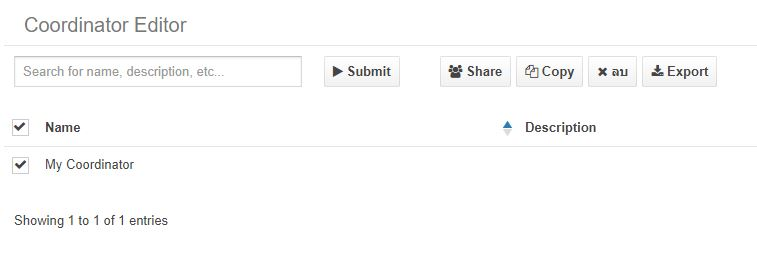

# End to End Hadoop


## Installation

Set-up Google Compute Engine


Install docker on Ubuntu 18 to Step 1-4 from 

* https://www.digitalocean.com/community/tutorials/how-to-install-and-use-docker-on-ubuntu-18-04

Download Cloudera
```
docker pull mikelemikelo/cloudera-spark:latest 
```

Run Cloudera
```
docker run --hostname=quickstart.cloudera --privileged=true -it -p 8888:8888 -p 8080:8080 -p 7180:7180 -p 88:88/udp -p 88:88 mikelemikelo/cloudera-spark:latest /usr/bin/docker-quickstart-light
```

Start Cloudera Manager
```
sudo /home/cloudera/cloudera-manager --express && service ntpd start 
```

Sign in Cloudera Manager using Public/External IP of VM port 7180

* example http://34.87.136.199:7180/ -> user:cloudera, pw:cloudera

Add service “Flume”


Start cluster


Sign in Cloudera HUE using Public/External IP of VM port 8888

* example http://34.87.136.199:8888/ -> user:cloudera, pw:cloudera

Clone Git Repository to Ubuntu
```
git clone https://github.com/chanontv/hadoop-end-to-end.git
```

Copy folder to container
```
docker cp hadoop-r2de-data/data <container_id>:/
```

Execute bash command
```
docker exec -it <container_id> /bin/bash
```

## Batch Layer


Make directory in Hadoop
```
hadoop fs -mkdir /tmp/file/
hadoop fs -mkdir /tmp/file/sink
```

Copy file customer.csv to hadoop
```
hadoop fs -put /data/file/source//customer.csv /tmp/file/sink
```

Create table customers at Cloudera HUE > Hive Editor

* [create_hive_customers.sql](https://github.com/chanontv/hadoop-end-to-end/blob/main/data/sql/create_hive_customers.sql)

Run SparkSQL
```
spark-submit /data/spark/spark.py
```

Create table customers_cln at Cloudera HUE > Hive Editor

* [create_hive_customers_cln.sql](https://github.com/chanontv/hadoop-end-to-end/blob/main/data/sql/create_hive_customers_cln.sql)

### End Batch Layer

## Speed Layer


Make directory in Hadoop
```
hadoop fs -mkdir /tmp/flume/
hadoop fs -mkdir /tmp/flume/sink
```

Create table in Hbase
```
hbase shell
create 'spooled_table', 'spool_cf'
```

Run Shell Script
```
nohup sh /data/flume/src_sys.sh &
```

Run Flume Scripts
```
nohup flume-ng agent -n tier1 -f /data/flume/source/flume_hdfs.conf &
nohup flume-ng agent -n tier2 -f /data/flume/source/flume_hbase.conf &
```

Create table transactions at Cloudera HUE > Hive Editor

* [create_hive_transactions.sql](https://github.com/chanontv/hadoop-end-to-end/blob/main/data/sql/create_hive_transactions.sql)

Run Spark Streaming
```
nohup spark-submit /data/spark_streaming/spark_streaming.py &
```

Create table transactions_cln at Cloudera HUE > Hive Editor

* [create_hive_transactions_cln.sql](https://github.com/chanontv/hadoop-end-to-end/blob/main/data/sql/create_hive_transactions_cln.sql)

### End Speed Layer

Create table members by Hive command
```
hive -f /data/sql/create_hive_loyalty.sql
```

Insert data by JOIN customer_cln and transactions_cln at Cloudera HUE > Hive Editor

* [insert_hive_loyalty.sql](https://github.com/chanontv/hadoop-end-to-end/blob/main/data/sql/insert_hive_loyalty.sql)


## Workflow with Apache Oozie
Copy file [insert_hive_loyalty.sql](https://github.com/chanontv/hadoop-end-to-end/blob/main/data/sql/insert_hive_loyalty.sql) to hadoop 
```
hadoop fs -put /data/sql/insert_hive_loyalty.sql /tmp/file/
```

Create Workflow


Create Coordinator


Run Coordinator




### Finish 
